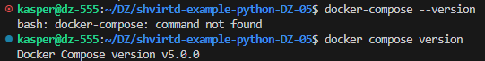
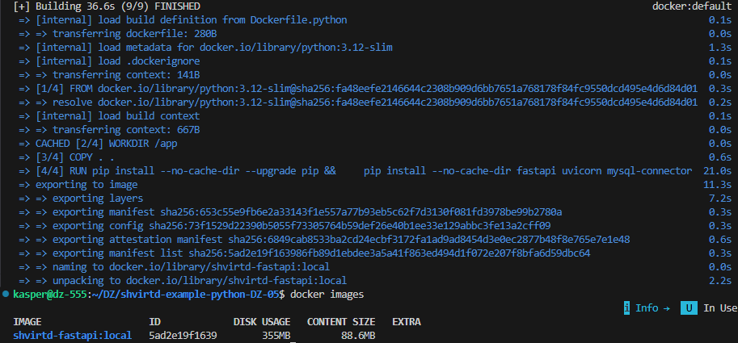
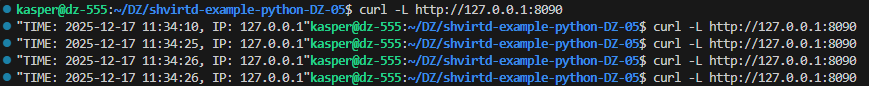
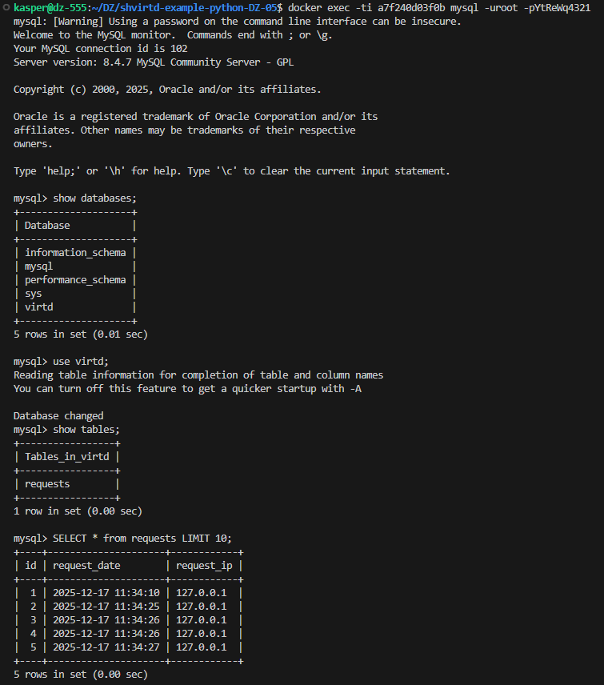
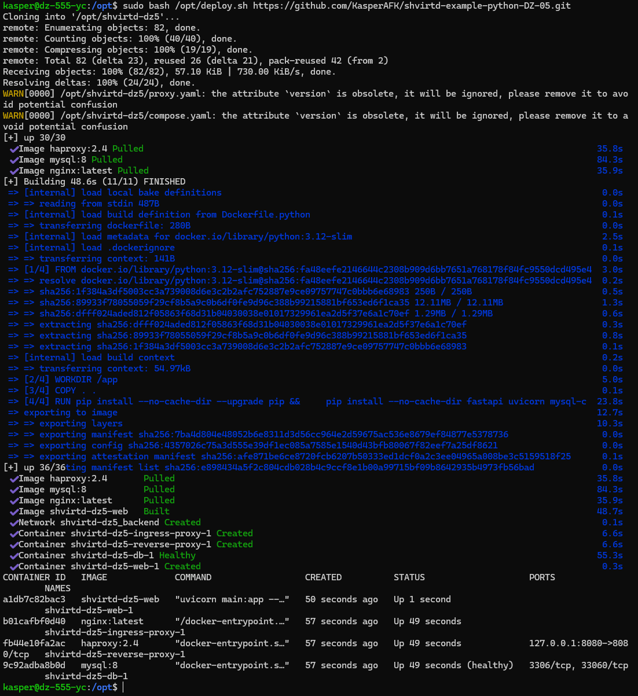
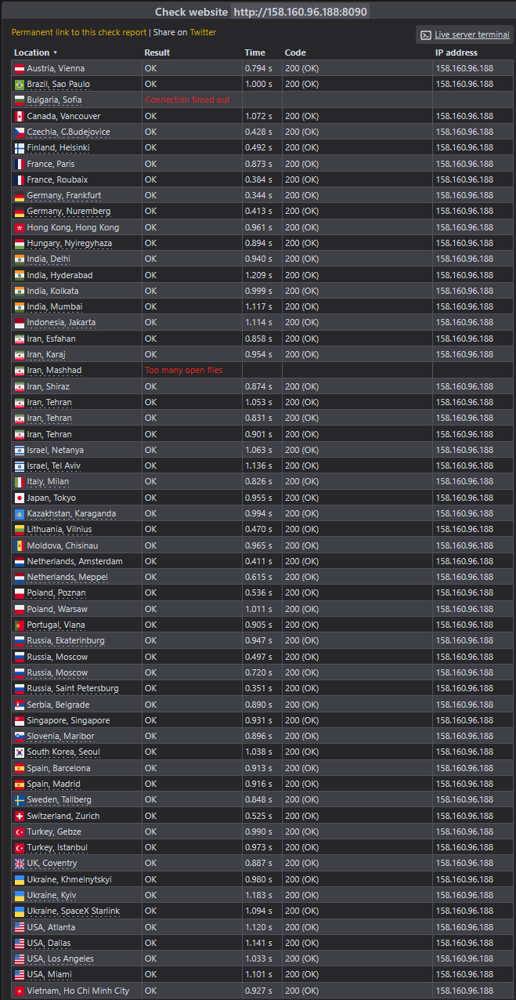
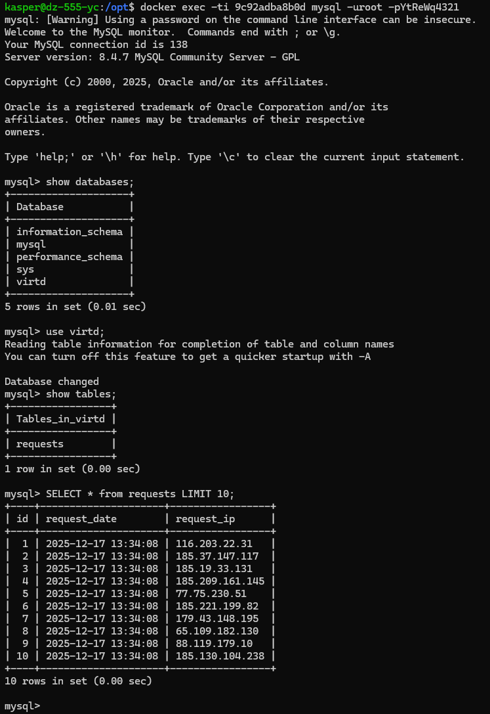

# ДЗ по теме "Практическое применение Docker"

## Задание 0



## Задание 1

Dockerfile.python
```
FROM python:3.12-slim

WORKDIR /app

COPY . .

RUN pip install --no-cache-dir --upgrade pip && \
    pip install --no-cache-dir fastapi uvicorn mysql-connector-python

CMD ["uvicorn", "main:app", "--host", "0.0.0.0", "--port", "5000"]
```

.dockerignore
```
.git
.gitignore

__pycache__/
*.pyc
*.pyo
*.pyd

.venv/
venv/
env/

.idea/
.vscode/

*.log
.DS_Store

```



## Задание 3

compose.yaml
```
version: "3.8"

include:
  - proxy.yaml

services:
  db:
    image: mysql:8
    restart: always
    environment:
      MYSQL_ROOT_PASSWORD: ${MYSQL_ROOT_PASSWORD}
      MYSQL_DATABASE: ${MYSQL_DATABASE}
      MYSQL_USER: ${MYSQL_USER}
      MYSQL_PASSWORD: ${MYSQL_PASSWORD}
    networks:
      backend:
        ipv4_address: 172.20.0.10
    healthcheck:
      test: ["CMD-SHELL", "mysqladmin ping -h 127.0.0.1 -uroot -p${MYSQL_ROOT_PASSWORD} --silent"]
      interval: 5s
      timeout: 3s
      retries: 20
      start_period: 20s

  web:
    build:
      context: .
      dockerfile: Dockerfile.python
    restart: always
    environment:
      DB_HOST: db
      DB_USER: ${MYSQL_USER}
      DB_PASSWORD: ${MYSQL_PASSWORD}
      DB_NAME: ${MYSQL_DATABASE}
    depends_on:
      db:
        condition: service_healthy
    networks:
      backend:
        ipv4_address: 172.20.0.5

networks:
  backend:
    driver: bridge
    ipam:
      config:
        - subnet: 172.20.0.0/24
```






## Задание 4

Запуск скрипта:


Сайт проверки http подключений


SQL-запрос на сервере: 


ссылка на fork:
https://github.com/KasperAFK/shvirtd-example-python-DZ-05
