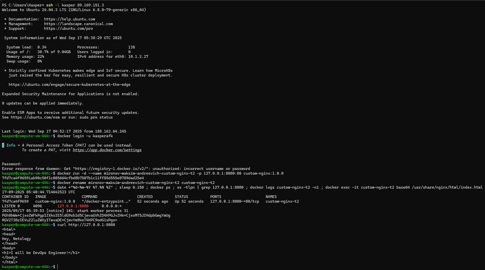

## Задача 1
https://hub.docker.com/r/kasperafk/custom-nginx/tags
## Задача 2

## Задача 3
![[DZ444_2.png]]
![[DZ444_3.png]]
![[DZ444_4.png]]

3.Выполните `docker ps -a` и объясните своими словами почему контейнер остановился?
- Контейнер остановился потому что мы использовали docker attach и после этого прервали основной процесс нажатием CTRL+C.
10.Проверьте вывод команд: `ss -tlpn | grep 127.0.0.1:8080` , `docker port custom-nginx-t2`, `curl http://127.0.0.1:8080`. Кратко объясните суть возникшей проблемы.
- Мы изменили конфигурацию NGINX 80->81 и не обновили проброс портов Docker
## Задача 4
![[DZ444_5.png]]
## Задача 5
### Задание №1
![[DZ444_6.png]]
- Фиолетовым выделен файл, который предпочел docker compose (compose.yaml)
1.И выполните команду "docker compose up -d". Какой из файлов был запущен и почему?
- Из документации: "The default path for a Compose file is `compose.yaml` (preferred) or `compose.yml` that is placed in the working directory. Compose also supports `docker-compose.yaml` and `docker-compose.yml` for backwards compatibility of earlier versions. If both files exist, Compose prefers the canonical `compose.yaml`." 
- Другими словами: Ищем последовательно: "compose.yaml" далее "compose.yml", далее "docker-compose.yaml" далее "docker-compose.yml".

### Задание №2
![[Pasted image 20250917103432.png]]
2.Отредактируйте файл compose.yaml так, чтобы были запущенны оба файла.
- Достаточно добавить `include`раздел в основной compose.yaml файл, для объявления зависимости c docker-compose.yaml

### Задание №3
![[DZ444_7.png]]

И тут я понимаю что облачная ВМ не подходит

### Задание №6
![[DZ444_9.png]]
![[DZ444_10 1.png]]

![[DZ444_11.png]]

### Задание №7
![[DZ444_12.png]]
Атрибут `version` в файле устарел и будет проигнорирован
Docker Compose обнаружил только один файл (`docker-compose.yaml`)

![[Pasted image 20250917163444.png]]
