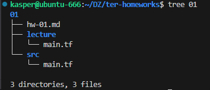
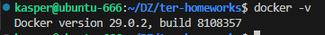
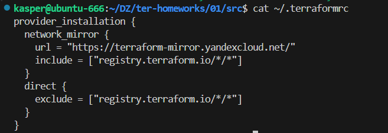
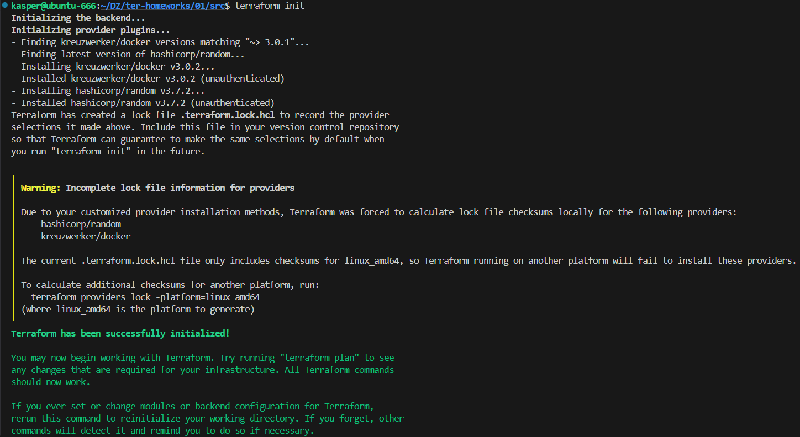
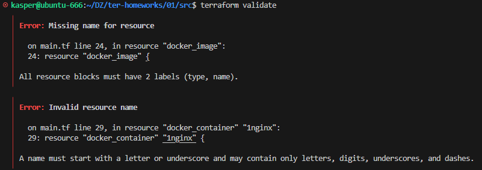
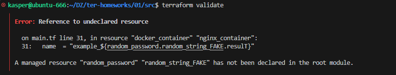

# ДЗ по теме "Введение в Terraform"
## Задание 0.1

## Задание 0.2

## Задание 0.3

## Корректировка для тех кто живет в России

## Задание 1

## Задание 2 
"Изучите файл .gitignore. В каком terraform-файле, согласно этому .gitignore, допустимо сохранить личную, секретную информацию?(логины,пароли,ключи,токены итд)"

В файле personal.auto.tfvars

## Задание 3
"3. Выполните код проекта. Найдите  в state-файле секретное содержимое созданного ресурса **random_password**, пришлите в качестве ответа конкретный ключ и его значение."

"result": "B31DKRLywEAAYkAl",

## Задание 4

1. Отсутствует имя. Например "nginx"
2. В docker_container имя ресурса "1nginx" не должно начинаться с цифры, мы переименуем в "nginx_container"

