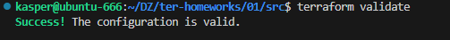
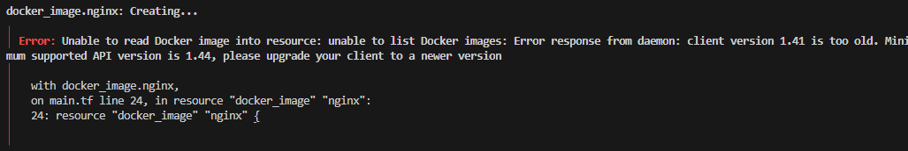

# ДЗ по теме "Введение в Terraform"
## Задание 0.1


## Задание 0.2


## Задание 0.3


## Корректировка для тех кто живет в России


## Задание 1


## Задание 2 
"Изучите файл .gitignore. В каком terraform-файле, согласно этому .gitignore, допустимо сохранить личную, секретную информацию?(логины,пароли,ключи,токены итд)"

В файле personal.auto.tfvars

## Задание 3
"3. Выполните код проекта. Найдите  в state-файле секретное содержимое созданного ресурса **random_password**, пришлите в качестве ответа конкретный ключ и его значение."


"result": "B31DKRLywEAAYkAl",

## Задание 4


1. Отсутствует имя. Например "nginx"
2. В docker_container имя ресурса "1nginx" не должно начинаться с цифры, мы переименуем в "nginx_container"


3.Ссылки на ресурс не существует. Имя "random_password.random_string_FAKE" не совпадает с фактическим. А так же в "resulT" допущен неправильный регистр.



Теперь команда "terraform validate" проходит успешно.



НО при попыке "terraform apply" жалуется на версию. Исправляем и пробуем.


## Задание 5

"terraform apply" проходит успешно и после команды "docker ps" видим поднятый контейнер


Исправленный код:

```
terraform {
  required_providers {
    docker = {
      source  = "kreuzwerker/docker"
      version = "~> 3.5.0"
    }
  }
  required_version = "~>1.12.0" /*Многострочный комментарий.
 Требуемая версия terraform */
}
provider "docker" {}

#однострочный комментарий

resource "random_password" "random_string" {
  length      = 16
  special     = false
  min_upper   = 1
  min_lower   = 1
  min_numeric = 1
}


resource "docker_image" "nginx" {
  name         = "nginx:latest"
  keep_locally = true
}

resource "docker_container" "nginx_container" {
  image = docker_image.nginx.image_id
  name  = "example_${random_password.random_string.result}"

  ports {
    internal = 80
    external = 9090
  }
}


```

