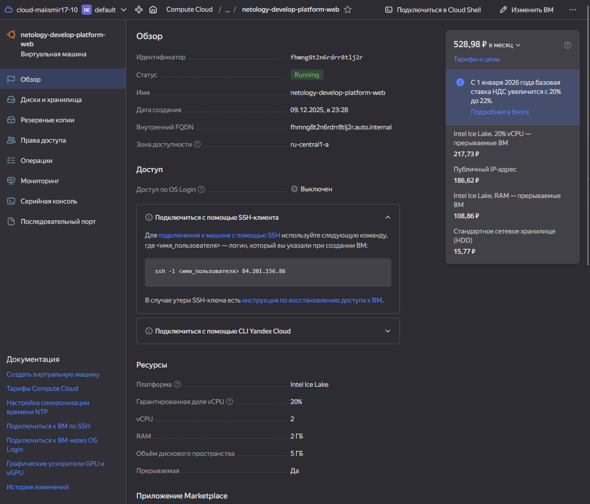
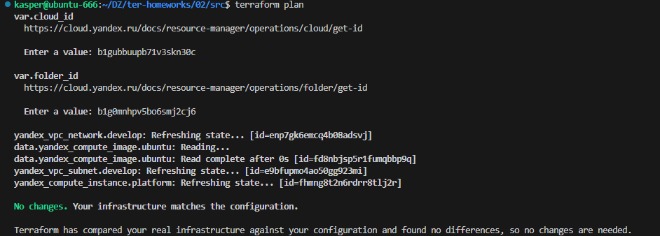
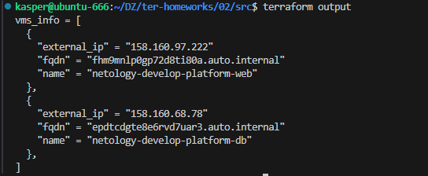

# ДЗ по теме "Основы Terraform. Yandex Cloud"

## Задание 0


## Задание 1

### 1.2


### 1.3


### 1.4
Здесь некорректно указан путь. Terraform не знает что делать с данным символом (~). генерируем файл и указываем абсолютыне пути.


Был не верно указан "platform_id = "standart-v4""


Результат:


terraform apply


Не каждая зона поддерживает v4

Меняем на v3 (Не забываем удалить все что создалось до моменты ошибки) terraform destroy

Итог который заводится 


### 1.5


### 1.6

preemptible = true - внезапная остановка ВМ (как вы ранее описывали: Экономия гранта)

core_fraction=5 - позволяет выделять VM только часть виртуального CPU. (Все тоже самое "Экономия гранта")

В качестве решения приложите:




## Задание 2


main.tf
```tf
resource "yandex_vpc_network" "develop" {
  name = var.vpc_name
}
resource "yandex_vpc_subnet" "develop" {
  name           = var.vpc_name
  zone           = var.default_zone
  network_id     = yandex_vpc_network.develop.id
  v4_cidr_blocks = var.default_cidr
}


data "yandex_compute_image" "ubuntu" {
  family = var.vm_web_image_family
}
resource "yandex_compute_instance" "platform" {
  name        = var.vm_web_name
  platform_id = var.vm_web_platform
  resources {
    cores         = var.vm_web_cores
    memory        = var.vm_web_memory
    core_fraction = var.vm_web_core_fraction
  }
  boot_disk {
    initialize_params {
      image_id = data.yandex_compute_image.ubuntu.image_id
    }
  }
  scheduling_policy {
    preemptible = var.vm_web_preemptible
  }
  network_interface {
    subnet_id = yandex_vpc_subnet.develop.id
    nat       = true
  }

  metadata = {
    serial-port-enable = 1
    ssh-keys           = "ubuntu:${var.vms_ssh_root_key}"
  }

}
```

variables.tf
```tf
###cloud vars


variable "cloud_id" {
  type        = string
  description = "https://cloud.yandex.ru/docs/resource-manager/operations/cloud/get-id"
}

variable "folder_id" {
  type        = string
  description = "https://cloud.yandex.ru/docs/resource-manager/operations/folder/get-id"
}

variable "default_zone" {
  type        = string
  default     = "ru-central1-a"
  description = "https://cloud.yandex.ru/docs/overview/concepts/geo-scope"
}
variable "default_cidr" {
  type        = list(string)
  default     = ["10.0.1.0/24"]
  description = "https://cloud.yandex.ru/docs/vpc/operations/subnet-create"
}

variable "vpc_name" {
  type        = string
  default     = "develop"
  description = "VPC network & subnet name"
}

###Добавлено мной 
variable "service_account_key_file" {
  type        = string
  description = "/home/kasper/.authorized_key.json"
  default     = "/home/kasper/.authorized_key.json"
}

###ssh vars

variable "vms_ssh_root_key" {
  type        = string
  default     = "ssh-ed25519 AAAAC3NzaC1lZDI1NTE5AAAAILSX7L9kEfKj4GeYrmzBnRnIAsjcGJ8J+eG7yd44cFjs kasper@ubuntu-666"
  description = "ssh-keygen -t ed25519"
}

### VM vars (для задания 2)
variable "vm_web_name" {
  type    = string
  default = "netology-develop-platform-web"
}

variable "vm_web_platform" {
  type    = string
  default = "standard-v3"
}

variable "vm_web_cores" {
  type    = number
  default = 2
}

variable "vm_web_memory" {
  type    = number
  default = 2
}

variable "vm_web_core_fraction" {
  type    = number
  default = 20
}

variable "vm_web_preemptible" {
  type    = bool
  default = true
}

variable "vm_web_ssh_user" {
  type    = string
  default = "ubuntu"
}

variable "vm_web_image_family" {
  type    = string
  default = "ubuntu-2004-lts"
}
```




## Задание 3

## Задание 4


