# ДЗ по теме "Основы Terraform. Yandex Cloud"

## Задание 0

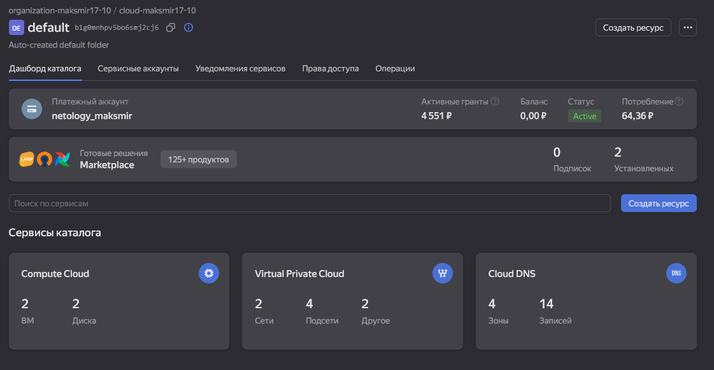

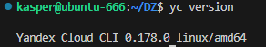

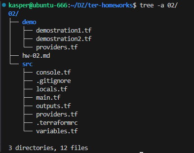

## Задание 1

### 2.

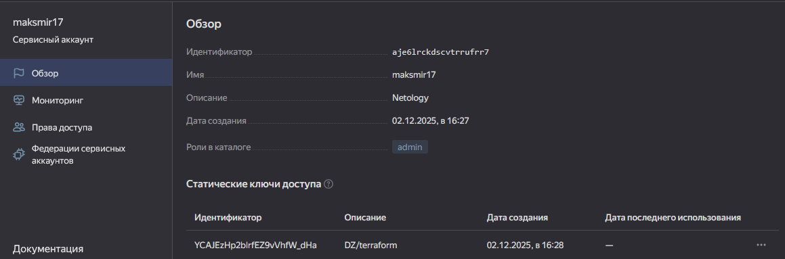

### 3.

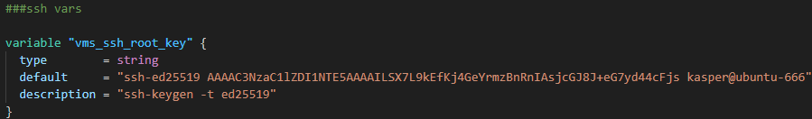

### 4.
Здесь некорректно указан путь. Terraform не знает что делать с данным символом (~). генерируем файл и указываем абсолютыне пути.
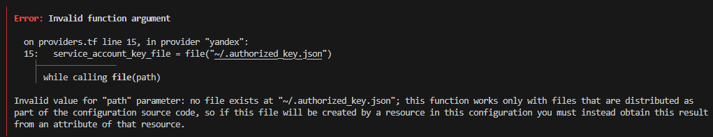

Был не верно указан "platform_id = "standart-v4""

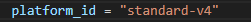

Результат:

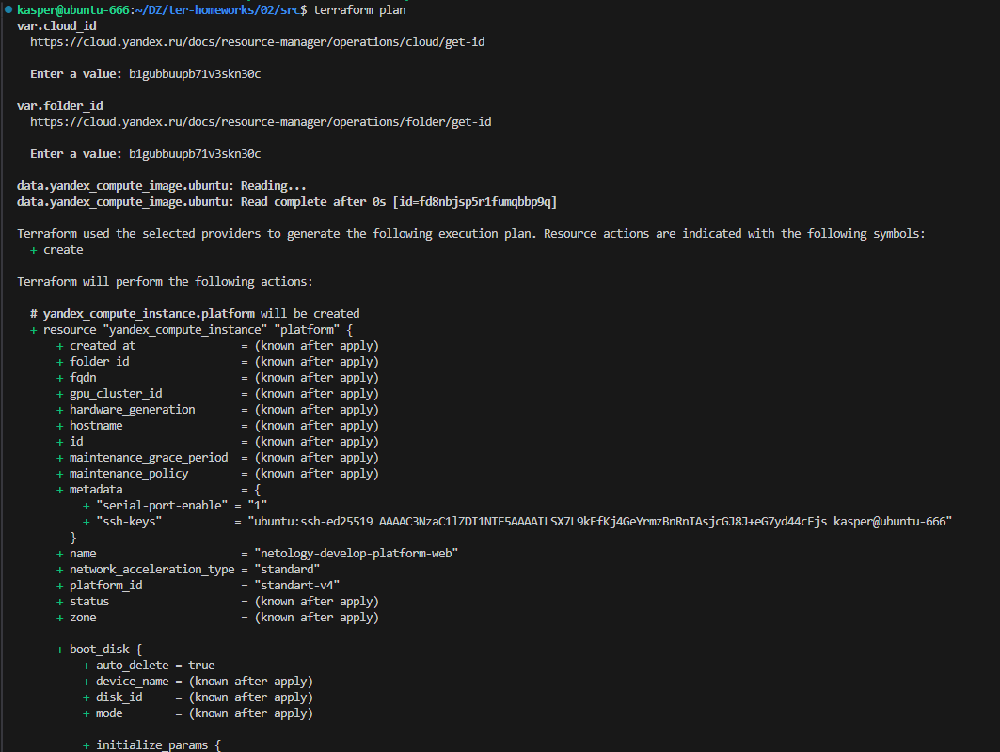
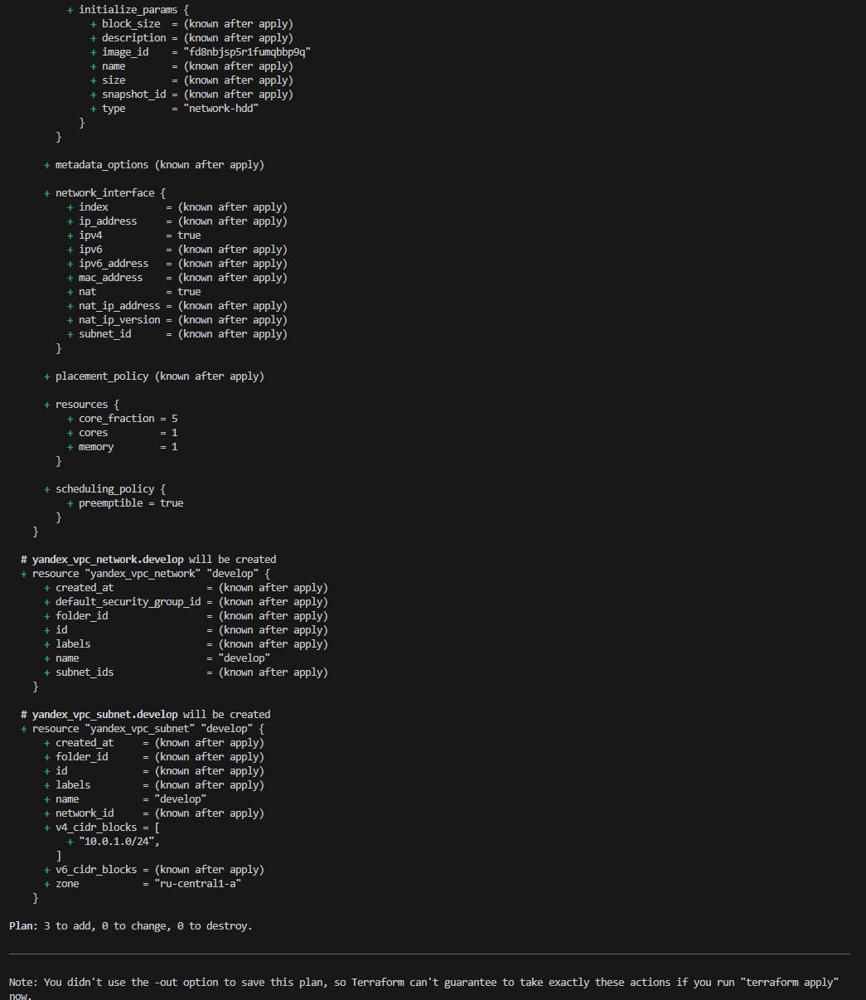

terraform apply

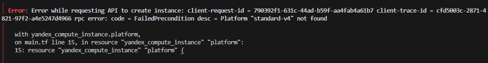

Не каждая зона поддерживает v4

Меняем на v3 (Не забываем удалить все что создалось до моменты ошибки) terraform destroy

Итог который заводится 

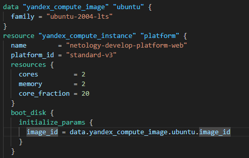

### 5.

### 6.
