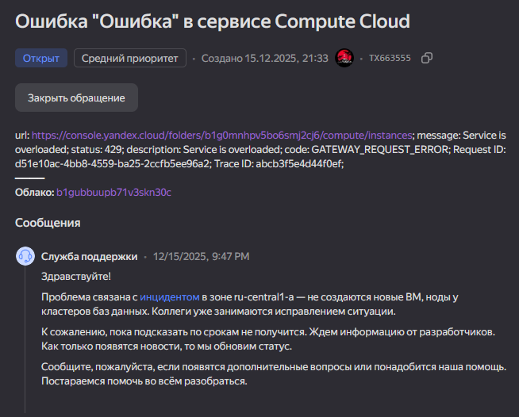
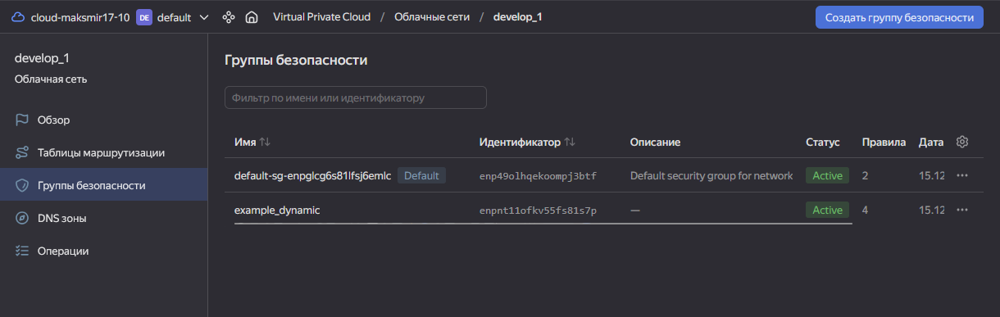

# ДЗ по теме "Управляющие конструкции в коде Terraform"

## Коментарий перед выполнением 

В момент выполнения задания у Яндекса были проблемы с зоной "ru-central1-a". По этому изменяю зону на "ru-central1-b".

И так же в подвешенном состаянии осталась сеть "develop". Сеть для данного ДЗ будет называться "develop_1".

## Задание 1

